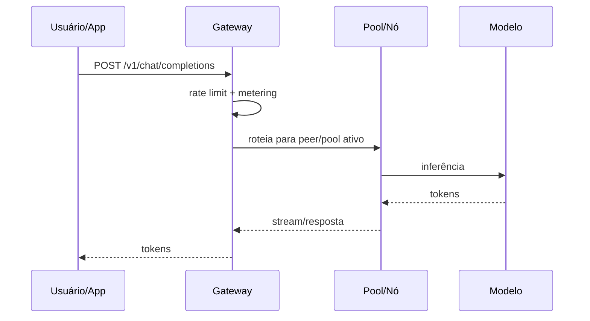
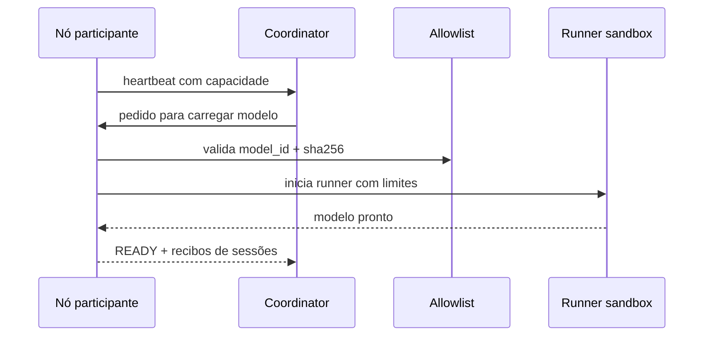

# Prometeu

> Infraestrutura comunitária para inferência distribuída de LLMs open source.

[](LICENSE)
[](https://github.com/maxwellmelo/prometeu)

**Prometeu** transforma máquinas comuns em uma rede colaborativa de inferência para modelos de linguagem open source. A ideia é simples: muitas pessoas têm CPU, RAM, GPU pequena, notebook parado, servidor doméstico, VPS ou workstation subutilizada. Sozinhos, esses recursos parecem pequenos. Juntos, formam capacidade real para servir LLMs abertas de forma pública, auditável e compartilhada.

Prometeu foi criado para dar poder à comunidade que acredita em LLMs open source, acesso democrático e infraestrutura transparente. Pessoas que não querem ou não podem pagar mensalidades altas precisam de alternativa coletiva: uma rede onde quem usa também pode contribuir, onde capacidade ociosa vira acesso, e onde todo o stack pode ser estudado, auditado, executado e melhorado.

---

## Índice

- [Missão](#missão)
- [O que Prometeu faz](#o-que-prometeu-faz)
- [Como funciona](#como-funciona)
- [Arquitetura](#arquitetura)
- [Principais capacidades](#principais-capacidades)
- [Fluxos de uso](#fluxos-de-uso)
- [API de inferência](#api-de-inferência)
- [Nós participantes](#nós-participantes)
- [Pools de modelo](#pools-de-modelo)
- [Reciprocidade e autenticação](#reciprocidade-e-autenticação)
- [Segurança](#segurança)
- [Observabilidade](#observabilidade)
- [Instalação](#instalação)
- [Teste e desenvolvimento](#teste-e-desenvolvimento)
- [Roadmap](#roadmap)
- [Contribuição](#contribuição)
- [Atribuição e licença](#atribuição-e-licença)
- [English summary](#english-summary)

---

## Missão

LLMs open source só cumprem sua promessa quando comunidade também controla meios de execução.

Modelo aberto sem infraestrutura acessível ainda deixa muita gente de fora. Prometeu tenta resolver essa lacuna criando uma camada comunitária para:

- **compartilhar capacidade de inferência** entre participantes;
- **servir modelos open source** por uma API simples;
- **rotear pedidos para nós voluntários** que têm capacidade disponível;
- **medir contribuição real** com recibos assinados;
- **aumentar limite de uso para quem contribui**;
- **proteger usuários contra modelos adulterados** com allowlist hash-pinned;
- **permitir auto-hospedagem completa** sem depender de caixa-preta;
- **dar base para uma rede pública de IA aberta**, mantida por pessoas, projetos, laboratórios independentes e comunidades locais.

Prometeu não tenta vencer por throughput bruto. Prometeu tenta vencer por soberania, custo compartilhado, transparência e capacidade coletiva.

---

## O que Prometeu faz

Prometeu é um stack completo para inferência distribuída:

| Capacidade | Descrição |
|---|---|
| Gateway `/v1` | Entrada HTTP para apps, CLIs, bots e UIs chamarem modelos usando formato comum de chat/completions. |
| Rede P2P | Nós se conectam por mesh com identidade Ed25519 e transporte criptografado via Iroh. |
| Registro de nós | Participantes anunciam capacidade, modelos ativos, limites e estado de saúde. |
| Pool orchestration | Coordenador recebe pedido de modelo, calcula recursos, escolhe peers, aquece pool e acompanha estado. |
| Peer-direct routing | Gateway pode enviar inferência para nó voluntário que está servindo modelo solicitado. |
| Sizer GGUF | Lê metadados de modelo GGUF e estima RAM/número de peers necessários. |
| Sandbox de inferência | Runner dedicado com usuário isolado e limites via systemd/cgroups. |
| Catálogo allowlist | Só modelos curados e com hash conhecido podem ser carregados por nós participantes. |
| Reciprocidade | Quem serve tokens recebe maior headroom de uso. |
| Auth Ed25519 | Challenge/response prova posse de chave, sem confiar em identidade declarada. |
| Recibos assinados | Sessões geram recibos CBOR assinados com contadores. |
| Métricas | `/metrics` expõe dados para Prometheus. |
| Watchdog | Verifica pools periodicamente e alerta só em incidente real. |
| Auto-hospedagem | Scripts permitem subir coordinator, workers, gateway e node daemon. |

---

## Como funciona

Prometeu separa três papéis.

### 1. Usuário de inferência

Usuário manda requisição para `/v1/chat/completions` com modelo desejado. Gateway aplica limite, mede consumo e encaminha para pool ou nó capaz de responder.



### 2. Contribuidor de nó

Contribuidor instala daemon local. Nó detecta hardware, define limites, anuncia capacidade e pode servir modelos permitidos.



### 3. Operador de coordinator

Operador mantém gateway/coordinator, catálogo, registry, Redis, métricas e políticas. Pode criar rede pública, rede local, laboratório acadêmico, cluster comunitário, ambiente de pesquisa ou infraestrutura própria.

---

## Arquitetura

```text
                    ┌─────────────────────────────┐
                    │ Apps / UIs / CLIs / Bots     │
                    └──────────────┬──────────────┘
                                   │ HTTP /v1
                                   ▼
┌────────────────────────────────────────────────────────────┐
│ Gateway / Coordinator                                      │
│ - roteamento de inferência                                 │
│ - rate limit e metering                                    │
│ - pool orchestration                                       │
│ - GGUF sizing                                              │
│ - allowlist hash-pinned                                    │
│ - auth Ed25519                                             │
│ - ledger de reciprocidade                                  │
│ - registry e métricas                                      │
└──────────────┬─────────────────────┬───────────────────────┘
               │                     │
               │ Registry/Redis      │ P2P mesh / peer-direct
               ▼                     ▼
      ┌────────────────┐     ┌──────────────────────────┐
      │ Estado de nós  │     │ Nós participantes         │
      │ Pools          │     │ - daemon local            │
      │ Receipts       │     │ - dashboard :8787         │
      │ Ledger         │     │ - runner sandbox          │
      └────────────────┘     │ - llama.cpp server/RPC     │
                             │ - recibos assinados       │
                             └──────────────────────────┘
```

Componentes principais:

| Componente | Papel |
|---|---|
| `gateway/` | FastAPI coordinator: `/v1`, pools, registry, allowlist, auth, metrics, reciprocity. |
| `mesh/` | Binário Rust com Iroh P2P, identidade Ed25519, TCP bridge e receipts assinados. |
| `node/` | Daemon participante, dashboard local, instalador, sandbox runner. |
| `node-agent/` | Agente leve de telemetria/capacidade. |
| `scripts/` | Build, instalação, workers, watchdog, prova de distribuição. |
| `tests/` | Suite pytest cobrindo router, sizer, pools, reciprocity e allowlist. |
| `web/` | Interface web mínima de chat, sem build step. |
| `assets/` | Marca e badge. |
| `docs/` | Notas técnicas e decisões de design. |

---

## Principais capacidades

### Gateway de inferência

- endpoint `/v1/chat/completions`;
- suporte a streaming;
- proxy para servidor de inferência compatível com formato de chat/completions;
- metering de tokens em resposta stream e non-stream;
- limite por IP e por identidade autenticada;
- header de atribuição automático.

### Rede P2P

- transporte com Iroh;
- identidade persistente Ed25519;
- `NodeId` derivado de chave pública;
- handshake CBOR;
- bridge TCP bidirecional;
- descoberta via registry;
- sem exigência de abrir portas em cenários NAT comuns.

### Pool orchestration

- pedido de modelo por `model_id`;
- cálculo automático de recursos;
- seleção de peers com RAM/capacidade suficiente;
- comando remoto para carregar modelo;
- estados `REQUESTED`, `WARMING`, `READY`, `DEGRADED`, `FAILED`, `STOPPED`;
- watchdog periódico para incidente.

### Node daemon

- dashboard local em `http://localhost:8787`;
- fingerprint de hardware: CPU, RAM, disco, GPU/VRAM quando disponível;
- seleção de modelos do catálogo;
- definição de limites locais;
- heartbeat periódico para registry;
- runner sandbox com usuário dedicado;
- limites via cgroups/systemd;
- preflight de bloqueadores antes de servir.

### Segurança por catálogo curado

- allowlist com `model_id`, origem e `sha256` esperado;
- off-list rejeitado;
- hash mismatch rejeitado;
- sem fallback para download não verificado;
- defesa principal contra pesos adulterados.

### Reciprocidade

- contribuição medida por tokens servidos;
- consumo medido por tokens usados;
- recibos assinados alimentam ledger;
- limite cresce para quem contribui;
- anônimos mantêm piso de acesso;
- sistema desenhado como soft-quota, não paywall.

---

## Fluxos de uso

### Quero usar uma LLM open source

1. Escolha modelo disponível no catálogo.
2. Envie requisição para `/v1/chat/completions`.
3. Receba resposta por JSON ou streaming.
4. Se quiser mais headroom, rode nó participante e autentique sua chave.

### Quero contribuir com capacidade

1. Instale `prometeu-node`.
2. Defina limites de CPU/RAM/banda desejados.
3. Escolha modelos permitidos.
4. Nó anuncia capacidade.
5. Coordinator envia workload quando houver demanda.
6. Nó gera receipts assinados.
7. Seu standing de reciprocidade aumenta.

### Quero criar minha própria rede

1. Suba gateway/coordinator.
2. Configure Redis/registry.
3. Publique catálogo allowlist.
4. Instale nós participantes.
5. Aponte apps para endpoint `/v1` do seu coordinator.
6. Monitore `/metrics`.

---

## API de inferência

Prometeu usa formato HTTP comum para chat/completions em `/v1`.

Exemplo com `curl`:

```bash
curl -X POST http://localhost:3000/v1/chat/completions \
  -H 'content-type: application/json' \
  -d '{
    "model": "qwen",
    "messages": [
      {"role": "user", "content": "Explique inferência distribuída em uma frase."}
    ],
    "stream": false
  }'
```

Exemplo com streaming:

```bash
curl -N -X POST http://localhost:3000/v1/chat/completions \
  -H 'content-type: application/json' \
  -d '{
    "model": "qwen",
    "messages": [
      {"role": "user", "content": "Crie um manifesto curto para IA aberta."}
    ],
    "stream": true
  }'
```

Endpoints úteis:

| Endpoint | Uso |
|---|---|
| `POST /v1/chat/completions` | Inferência chat/completions. |
| `GET /api/catalog/allowlist` | Lista modelos permitidos e hashes esperados. |
| `POST /api/pools/request` | Solicita criação/aquecimento de pool. |
| `GET /api/pools` | Lista pools e estados. |
| `GET /api/registry/nodes` | Lista nós registrados. |
| `GET /api/mesh/peers` | Lista peers P2P anunciados. |
| `POST /api/auth/challenge` | Gera nonce para chave pública Ed25519. |
| `POST /api/auth/verify` | Verifica assinatura e emite token curto. |
| `GET /api/reciprocity/standing` | Consulta standing de reciprocidade. |
| `GET /metrics` | Métricas Prometheus. |

Use `http://localhost:3000` em ambiente local ou substitua por URL do seu próprio coordinator.

---

## Nós participantes

Nó participante é uma máquina que doa capacidade controlada para rede.

Instalação local a partir do repositório:

```bash
git clone https://github.com/maxwellmelo/prometeu.git
cd prometeu
sudo bash node/install.sh http://SEU_COORDINATOR:3000
```

Depois da instalação:

- dashboard local: `http://localhost:8787`;
- hardware detectado automaticamente;
- runner criado com usuário dedicado;
- limites aplicados via systemd/cgroups;
- heartbeat enviado ao coordinator;
- modelos só carregam se passarem na allowlist;
- receipts assinados registram serviço prestado.

Configuração típica do nó:

```json
{
  "coordinator_url": "http://SEU_COORDINATOR:3000",
  "cpu_quota": "200%",
  "memory_max": "6G",
  "bandwidth_mbps": 20,
  "allow_public_inference": true
}
```

`bandwidth_mbps` ainda é campo declarado; shaping real de banda está no roadmap.

---

## Pools de modelo

Pool é grupo de peers preparado para servir um modelo.

Fluxo:

1. Cliente solicita modelo.
2. Coordinator consulta allowlist.
3. Sizer calcula recursos necessários.
4. Registry encontra peers elegíveis.
5. Coordinator instrui peers a carregar modelo.
6. Peers baixam/verificam GGUF.
7. Pool aquece até quorum.
8. Gateway roteia inferência.

Exemplo:

```bash
curl -X POST http://localhost:3000/api/pools/request \
  -H 'content-type: application/json' \
  -d '{
    "model_id": "org/model/file.gguf",
    "source": "hf",
    "context": 4096
  }'
```

Consultar estado:

```bash
curl http://localhost:3000/api/pools
```

Estados:

| Estado | Significado |
|---|---|
| `REQUESTED` | Pedido recebido. |
| `WARMING` | Peers carregando/verificando modelo. |
| `READY` | Pool pronto para servir. |
| `DEGRADED` | Pool funciona, mas perdeu capacidade/quorum parcial. |
| `FAILED` | Pool falhou. |
| `STOPPED` | Pool parado intencionalmente. |

---

## Reciprocidade e autenticação

Prometeu usa reciprocidade porque rede comunitária precisa equilibrar uso e contribuição.

### Ledger

- **Contribuição**: tokens servidos por seu nó, comprovados por receipts assinados.
- **Consumo**: tokens usados via `/v1`.
- **Standing**: relação entre contribuição e consumo.
- **Quota**: limite suave derivado do standing.

Anônimo recebe piso. Contribuidor recebe mais headroom. Acima do limite, resposta pode ser `429` com `Retry-After`.

### Auth Ed25519

Identidade não é senha. Identidade é chave pública.

Fluxo:

```bash
# 1. pedir challenge
curl -X POST http://localhost:3000/api/auth/challenge \
  -H 'content-type: application/json' \
  -d '{"public_key":"<base64-ed25519-pub>"}'

# 2. assinar nonce com chave secreta e verificar
curl -X POST http://localhost:3000/api/auth/verify \
  -H 'content-type: application/json' \
  -d '{
    "public_key":"<base64-ed25519-pub>",
    "nonce":"<nonce>",
    "signature":"<base64-signature>"
  }'

# 3. consultar standing com bearer token
curl http://localhost:3000/api/reciprocity/standing \
  -H 'authorization: Bearer TOKEN'
```

Propriedades:

- nonce single-use;
- token curto;
- assinatura inválida rejeitada;
- replay rejeitado;
- sem trust-on-first-use.

---

## Segurança

Prometeu assume ambiente comunitário, logo trata confiança como recurso escasso.

Medidas atuais:

- **Allowlist hash-pinned**: modelo precisa estar em catálogo curado e bater sha256.
- **Sandbox runner**: inferência roda em usuário dedicado, com limites de CPU/RAM.
- **Preflight blockers**: nó recusa servir se requisitos mínimos faltarem.
- **Ed25519 identities**: peers e usuários podem provar posse de chave.
- **Signed receipts**: sessões geram prova assinada de serviço.
- **Rate limiting**: `/v1` protegido contra abuso simples.
- **Métricas**: estado operacional exposto para auditoria.
- **NOTICE/header**: derivados mantêm atribuição visível.

Não-goals atuais:

- execução de modelos fora do catálogo;
- confiar em hash declarado pelo cliente;
- aceitar modelo com hash divergente;
- tratar uptime como contribuição sem serviço real;
- esconder falhas de pool.

Planejado:

- mTLS entre coordinator e peers;
- shaping real de banda;
- reputação com compromissos mais fortes;
- dashboard público de transparência.

---

## Observabilidade

Prometeu expõe `/metrics` para Prometheus.

Métricas incluem:

- pools por estado;
- consumo de reciprocidade;
- contribuição registrada;
- rotas normalizadas para evitar cardinalidade explosiva;
- estado de nós via registry;
- watchdog silencioso quando saudável e ruidoso em incidente.

Exemplo:

```bash
curl http://localhost:3000/metrics
```

Watchdog:

- roda periodicamente;
- alerta `FAILED`;
- alerta `DEGRADED`;
- alerta under-quorum em estado não terminal;
- não alerta `STOPPED` intencional.

---

## Instalação

### Requisitos gerais

- Linux Debian/Ubuntu recomendado;
- Python 3.11+;
- Redis;
- systemd para sandbox/cgroups;
- build tools para llama.cpp;
- Rust toolchain se for compilar `mesh/`;
- espaço em disco para modelos GGUF.

### Subir coordinator local

```bash
git clone https://github.com/maxwellmelo/prometeu.git
cd prometeu
python3 -m venv .venv
. .venv/bin/activate
pip install -r gateway/requirements.txt
uvicorn gateway.app:app --host 0.0.0.0 --port 3000
```

Se nome do módulo local divergir, consulte `gateway/` e scripts de instalação do repositório. Scripts systemd ficam em `scripts/`.

### Compilar backend de inferência

```bash
sudo bash scripts/build-llama-cpp.sh
```

### Instalar worker clássico

```bash
sudo bash scripts/install-worker.sh
```

### Instalar stack completo por script

```bash
sudo bash scripts/install.sh
```

### Instalar nó participante

```bash
sudo bash node/install.sh http://SEU_COORDINATOR:3000
```

### Provar distribuição

```bash
bash scripts/prove-distribution.sh http://SEU_COORDINATOR:3000
```

Saída esperada mostra CPU/rede/TCP ativos nos nós durante geração.

---

## Teste e desenvolvimento

Rodar suite:

```bash
cd prometeu
python3 -m venv .venv
. .venv/bin/activate
pip install -r gateway/requirements.txt pytest
pytest tests/ -q
```

Suite cobre:

- roteamento;
- sizer GGUF;
- pools;
- allowlist;
- reciprocidade;
- autenticação Ed25519;
- métricas críticas.

Antes de PR:

```bash
pytest tests/ -q
```

Se mexer em contratos HTTP, adicione teste. Se mexer em segurança, adicione teste de rejeição, não só caminho feliz.

---

## Roadmap

### Feito

- Gateway `/v1` com streaming e metering.
- Rate limit por IP.
- Registry de nós com presença TTL.
- Telemetria de capacidade.
- Mesh P2P com Iroh.
- Identidade Ed25519.
- TCP bridge sobre mesh.
- Receipts CBOR assinados.
- Pool orchestration.
- Estados de pool.
- Sizer GGUF.
- Node daemon com dashboard local.
- Detecção CPU/RAM/disco/GPU.
- Runner sandbox com cgroups.
- Catálogo de modelos.
- Allowlist hash-pinned.
- Peer-direct routing.
- Auth signed-challenge.
- Ledger de reciprocidade.
- Prometheus `/metrics`.
- Watchdog de pools.
- Suite automatizada.

### Em andamento / planejado

- Shaping real de banda por nó.
- Dashboard público de transparência.
- mTLS coordinator ↔ peers.
- Reputação com compromissos slashable.
- Melhor UX para onboarding de nó.
- Catálogo curado maior.
- Health scoring por peer.
- Auto-recuperação de pools degradados.

### Pesquisa

- Download parcial por camada.
- Sharding real de pesos por layer.
- Workers heterogêneos CPU/GPU.
- Modelos maiores em pools dinâmicos.
- Scheduler sensível a latência/região.
- Verificação remota mais forte de execução.

---

## Contribuição

Prometeu precisa de ajuda em várias frentes:

| Área | Exemplos |
|---|---|
| Segurança | threat model, hardening, mTLS, sandbox, supply chain. |
| Sistemas distribuídos | scheduler, pool recovery, peer scoring, gossip/discovery. |
| Inferência | llama.cpp, GGUF sizing, streaming, batching, quantização. |
| Frontend | dashboard de nó, painel público, UX de onboarding. |
| DevOps | systemd, CI, releases, packages, observabilidade. |
| Documentação | tutoriais, guias, diagramas, exemplos de integração. |
| Comunidade | curadoria de modelos, testes em hardware diverso, tradução. |

Como contribuir:

1. Abra issue com contexto claro.
2. Rode testes antes do PR.
3. Mantenha mudanças pequenas quando possível.
4. Documente novo endpoint/comportamento.
5. Não adicione modelo à allowlist sem fonte e hash verificável.
6. Não inclua tokens, chaves, credenciais ou URLs sensíveis em commits.

---

## Atribuição e licença

Prometeu usa [Apache License 2.0](LICENSE) com cláusula de atribuição no [NOTICE](NOTICE).

Se você usar, modificar, redistribuir, embutir, publicar interface, operar API derivada ou construir em cima de Prometeu, precisa preservar atribuição.

Requisitos principais:

1. Interface com usuário deve mostrar **Powered by Prometeu** com link visível para este repositório.
2. API derivada deve preservar header:

```text
X-Powered-By: Prometeu (https://github.com/maxwellmelo/prometeu)
```

3. Redistribuição deve incluir [NOTICE](NOTICE).
4. Publicações, model cards e materiais que usem Prometeu devem citar projeto.

Badge:

```markdown
[](https://github.com/maxwellmelo/prometeu)
```

---

## English summary

**Prometeu** is community infrastructure for distributed inference of open source LLMs.

It turns ordinary machines into participant nodes, coordinates model pools, routes `/v1/chat/completions` requests, verifies hash-pinned model allowlists, measures real contribution with signed receipts, and gives contributors higher soft-quota through Ed25519-based reciprocity.

The goal is not only to run models. The goal is to help communities own usable inference capacity: transparent, auditable, self-hostable, and built around open models.

Key features:

- `/v1/chat/completions` gateway with streaming;
- P2P mesh using Iroh;
- Ed25519 identity and signed challenge auth;
- signed CBOR receipts;
- reciprocity ledger;
- model pool orchestration;
- GGUF resource sizing;
- participant node daemon;
- sandboxed inference runner;
- curated hash-pinned allowlist;
- Prometheus metrics;
- pool watchdog;
- full self-host path.

Run tests:

```bash
python3 -m venv .venv
. .venv/bin/activate
pip install -r gateway/requirements.txt pytest
pytest tests/ -q
```

Prometeu exists so open source LLM communities can share capacity instead of waiting for access to be granted from above.
