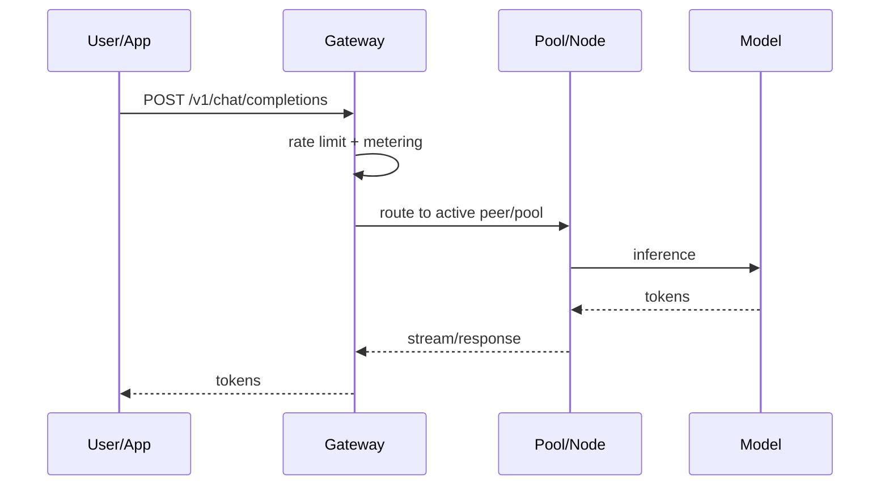
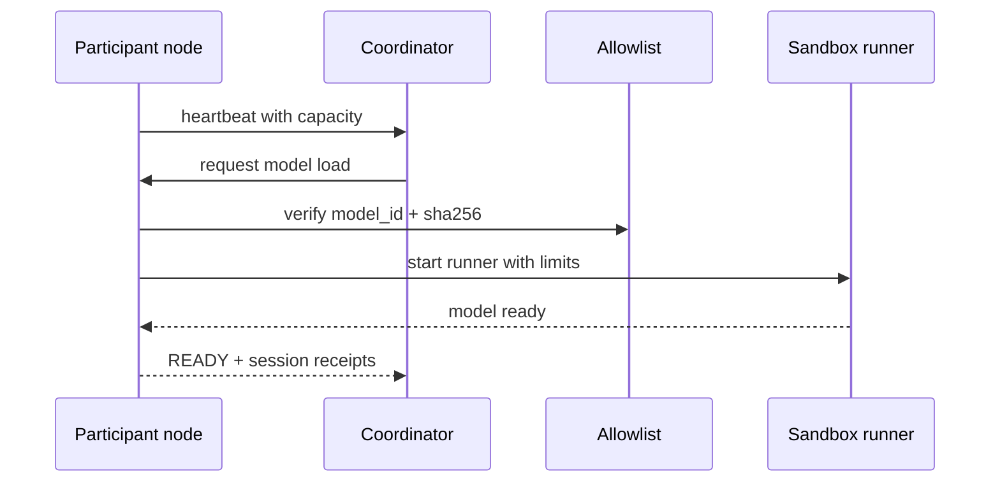

# Prometeu

> Community infrastructure for distributed inference of open source LLMs.

[](LICENSE)
[](https://github.com/maxwellmelo/prometeu)

**Prometeu** turns ordinary machines into a collaborative inference network for open source language models. Many people have unused CPU, RAM, small GPUs, laptops, home servers, VPS instances, lab machines, or workstations. Alone, those resources may look small. Together, they become real capacity for serving open LLMs through a transparent, auditable, community-owned stack.

Prometeu exists to give power back to communities that believe in open source LLMs, democratic access, and infrastructure that can be inspected, self-hosted, improved, and shared. People who cannot or do not want to pay high monthly fees need a collective alternative: a network where users can also contribute, idle capacity becomes access, and every operational component is open.

---

## Table of contents

- [Mission](#mission)
- [What Prometeu does](#what-prometeu-does)
- [How it works](#how-it-works)
- [Architecture](#architecture)
- [Core capabilities](#core-capabilities)
- [Usage flows](#usage-flows)
- [Inference API](#inference-api)
- [Participant nodes](#participant-nodes)
- [Model pools](#model-pools)
- [Reciprocity and authentication](#reciprocity-and-authentication)
- [Security](#security)
- [Observability](#observability)
- [Installation](#installation)
- [Testing and development](#testing-and-development)
- [Roadmap](#roadmap)
- [Contributing](#contributing)
- [Attribution and license](#attribution-and-license)

---

## Mission

Open source LLMs only fulfill their promise when communities also control the infrastructure needed to run them.

An open model without accessible inference capacity still leaves many people outside. Prometeu addresses that gap by building a community layer for:

- **sharing inference capacity** across participants;
- **serving open source models** through a simple API;
- **routing requests to volunteer nodes** with available resources;
- **measuring real contribution** with signed receipts;
- **giving contributors higher usage headroom**;
- **protecting users from poisoned weights** with a hash-pinned allowlist;
- **supporting full self-hosting** without black boxes;
- **laying groundwork for a public open AI network** maintained by people, projects, independent labs, and local communities.

Prometeu does not try to win by raw throughput alone. It aims to win by sovereignty, shared cost, transparency, and collective capacity.

---

## What Prometeu does

Prometeu is a full stack for distributed LLM inference:

| Capability | Description |
|---|---|
| `/v1` gateway | HTTP entrypoint for apps, CLIs, bots, and UIs using a common chat/completions format. |
| P2P mesh | Nodes connect through a mesh with Ed25519 identity and encrypted Iroh transport. |
| Node registry | Participants announce capacity, active models, limits, and health state. |
| Pool orchestration | Coordinator receives a model request, sizes it, selects peers, warms the pool, and tracks state. |
| Peer-direct routing | Gateway can route inference to the volunteer node serving the requested model. |
| GGUF sizer | Reads GGUF metadata and estimates RAM / peer count requirements. |
| Inference sandbox | Dedicated runner user with systemd/cgroup resource limits. |
| Curated allowlist | Only approved models with known hashes can be loaded by participant nodes. |
| Reciprocity | Nodes that serve tokens receive more usage headroom. |
| Ed25519 auth | Challenge/response proves key ownership without trusting claimed identity. |
| Signed receipts | Sessions produce signed CBOR receipts with counters. |
| Metrics | `/metrics` exposes Prometheus data. |
| Watchdog | Periodically checks pools and alerts only on real incidents. |
| Self-hosting | Scripts support running coordinator, workers, gateway, and node daemon. |

---

## How it works

Prometeu separates three roles.

### 1. Inference user

A user sends a request to `/v1/chat/completions` with a target model. The gateway applies limits, meters usage, and routes the request to a pool or node able to answer.



### 2. Node contributor

A contributor installs the local daemon. The node detects hardware, sets local limits, announces capacity, and can serve allowlisted models.



### 3. Coordinator operator

An operator runs the gateway/coordinator, catalog, registry, Redis, metrics, and policy layer. This can power a public community network, local collective, school lab, research cluster, project-specific network, or self-hosted deployment.

---

## Architecture

```text
                    ┌─────────────────────────────┐
                    │ Apps / UIs / CLIs / Bots     │
                    └──────────────┬──────────────┘
                                   │ HTTP /v1
                                   ▼
┌────────────────────────────────────────────────────────────┐
│ Gateway / Coordinator                                      │
│ - inference routing                                        │
│ - rate limiting and metering                               │
│ - pool orchestration                                       │
│ - GGUF sizing                                              │
│ - hash-pinned allowlist                                    │
│ - Ed25519 auth                                             │
│ - reciprocity ledger                                       │
│ - registry and metrics                                     │
└──────────────┬─────────────────────┬───────────────────────┘
               │                     │
               │ Registry/Redis      │ P2P mesh / peer-direct
               ▼                     ▼
      ┌────────────────┐     ┌──────────────────────────┐
      │ Node state     │     │ Participant nodes         │
      │ Pools          │     │ - local daemon            │
      │ Receipts       │     │ - dashboard :8787         │
      │ Ledger         │     │ - sandbox runner          │
      └────────────────┘     │ - llama.cpp server/RPC     │
                             │ - signed receipts         │
                             └──────────────────────────┘
```

Main components:

| Component | Role |
|---|---|
| `gateway/` | FastAPI coordinator: `/v1`, pools, registry, allowlist, auth, metrics, reciprocity. |
| `mesh/` | Rust binary with Iroh P2P, Ed25519 identity, TCP bridge, and signed receipts. |
| `node/` | Participant daemon, local dashboard, installer, sandbox runner. |
| `node-agent/` | Lightweight telemetry/capacity agent. |
| `scripts/` | Build, installation, workers, watchdog, and distribution proof tooling. |
| `tests/` | pytest suite covering router, sizer, pools, reciprocity, and allowlist. |
| `web/` | Minimal web chat interface, no build step. |
| `assets/` | Branding and badge assets. |
| `docs/` | Technical notes and design decisions. |

---

## Core capabilities

### Inference gateway

- `/v1/chat/completions` endpoint;
- streaming support;
- proxy to inference servers that support common chat/completions semantics;
- token metering for streaming and non-streaming responses;
- limits by IP and authenticated identity;
- automatic attribution header.

### P2P mesh

- Iroh transport;
- persistent Ed25519 identity;
- `NodeId` derived from the public key;
- CBOR handshake;
- bidirectional TCP bridge;
- registry-based discovery;
- no router port-forwarding required in common NAT scenarios.

### Pool orchestration

- model request by `model_id`;
- automatic resource sizing;
- peer selection based on RAM/capacity;
- remote instruction to load a model;
- states: `REQUESTED`, `WARMING`, `READY`, `DEGRADED`, `FAILED`, `STOPPED`;
- periodic watchdog for incidents.

### Node daemon

- local dashboard at `http://localhost:8787`;
- hardware fingerprint: CPU, RAM, disk, GPU/VRAM when available;
- model selection from catalog;
- local resource limits;
- heartbeat into registry;
- sandbox runner with dedicated user;
- cgroup/systemd limits;
- preflight blockers before serving.

### Curated catalog security

- allowlist with `model_id`, source, and expected `sha256`;
- off-list models rejected;
- hash mismatches rejected;
- no fallback to unverified downloads;
- primary defense against poisoned weights.

### Reciprocity

- contribution measured by tokens served;
- consumption measured by tokens used;
- signed receipts feed the ledger;
- contributors receive higher headroom;
- anonymous users keep a baseline floor;
- designed as a soft quota, not a paywall.

---

## Usage flows

### I want to use an open source LLM

1. Choose a model available in the catalog.
2. Send a request to `/v1/chat/completions`.
3. Receive a JSON response or token stream.
4. For more headroom, run a participant node and authenticate your key.

### I want to contribute capacity

1. Install `prometeu-node`.
2. Set CPU/RAM/bandwidth limits.
3. Choose allowlisted models.
4. Node announces capacity.
5. Coordinator sends workload when demand exists.
6. Node generates signed receipts.
7. Your reciprocity standing grows.

### I want to run my own network

1. Run gateway/coordinator.
2. Configure Redis/registry.
3. Publish a curated allowlist.
4. Install participant nodes.
5. Point apps to your coordinator `/v1` endpoint.
6. Monitor `/metrics`.

---

## Inference API

Prometeu uses a common HTTP chat/completions format under `/v1`.

Example with `curl`:

```bash
curl -X POST http://localhost:3000/v1/chat/completions \
  -H 'content-type: application/json' \
  -d '{
    "model": "qwen",
    "messages": [
      {"role": "user", "content": "Explain distributed inference in one sentence."}
    ],
    "stream": false
  }'
```

Streaming example:

```bash
curl -N -X POST http://localhost:3000/v1/chat/completions \
  -H 'content-type: application/json' \
  -d '{
    "model": "qwen",
    "messages": [
      {"role": "user", "content": "Write a short manifesto for open AI."}
    ],
    "stream": true
  }'
```

Useful endpoints:

| Endpoint | Purpose |
|---|---|
| `POST /v1/chat/completions` | Chat/completions inference. |
| `GET /api/catalog/allowlist` | List allowed models and expected hashes. |
| `POST /api/pools/request` | Request model pool creation/warmup. |
| `GET /api/pools` | List pools and states. |
| `GET /api/registry/nodes` | List registered nodes. |
| `GET /api/mesh/peers` | List announced P2P peers. |
| `POST /api/auth/challenge` | Create nonce for an Ed25519 public key. |
| `POST /api/auth/verify` | Verify signature and issue short-lived token. |
| `GET /api/reciprocity/standing` | Check reciprocity standing. |
| `GET /metrics` | Prometheus metrics. |

Use `http://localhost:3000` locally or replace it with your own coordinator URL.

---

## Participant nodes

A participant node is a machine that donates controlled capacity to the network.

Install from the repository:

```bash
git clone https://github.com/maxwellmelo/prometeu.git
cd prometeu
sudo bash node/install.sh http://YOUR_COORDINATOR:3000
```

After installation:

- local dashboard: `http://localhost:8787`;
- hardware detected automatically;
- runner created with dedicated user;
- limits applied with systemd/cgroups;
- heartbeat sent to coordinator;
- models load only after allowlist verification;
- signed receipts record served work.

Typical node config:

```json
{
  "coordinator_url": "http://YOUR_COORDINATOR:3000",
  "cpu_quota": "200%",
  "memory_max": "6G",
  "bandwidth_mbps": 20,
  "allow_public_inference": true
}
```

`bandwidth_mbps` is currently declared but not yet shaped; real bandwidth enforcement is on the roadmap.

---

## Model pools

A pool is a group of peers prepared to serve a model.

Flow:

1. Client requests a model.
2. Coordinator checks the allowlist.
3. Sizer estimates required resources.
4. Registry finds eligible peers.
5. Coordinator instructs peers to load the model.
6. Peers download and verify the GGUF.
7. Pool warms until quorum.
8. Gateway routes inference.

Example:

```bash
curl -X POST http://localhost:3000/api/pools/request \
  -H 'content-type: application/json' \
  -d '{
    "model_id": "org/model/file.gguf",
    "source": "hf",
    "context": 4096
  }'
```

Check state:

```bash
curl http://localhost:3000/api/pools
```

States:

| State | Meaning |
|---|---|
| `REQUESTED` | Request received. |
| `WARMING` | Peers are loading/verifying the model. |
| `READY` | Pool ready to serve. |
| `DEGRADED` | Pool works but lost capacity or partial quorum. |
| `FAILED` | Pool failed. |
| `STOPPED` | Pool intentionally stopped. |

---

## Reciprocity and authentication

Prometeu uses reciprocity because community infrastructure must balance usage and contribution.

### Ledger

- **Contribution**: tokens served by your node, proven by signed receipts.
- **Consumption**: tokens used through `/v1`.
- **Standing**: relationship between contribution and consumption.
- **Quota**: soft limit derived from standing.

Anonymous users receive a baseline floor. Contributors receive more headroom. Above the limit, the gateway may return `429` with `Retry-After`.

### Ed25519 auth

Identity is not a password. Identity is a public key.

Flow:

```bash
# 1. request challenge
curl -X POST http://localhost:3000/api/auth/challenge \
  -H 'content-type: application/json' \
  -d '{"public_key":"<base64-ed25519-pub>"}'

# 2. sign nonce with secret key and verify
curl -X POST http://localhost:3000/api/auth/verify \
  -H 'content-type: application/json' \
  -d '{
    "public_key":"<base64-ed25519-pub>",
    "nonce":"<nonce>",
    "signature":"<base64-signature>"
  }'

# 3. check standing with bearer token
curl http://localhost:3000/api/reciprocity/standing \
  -H 'authorization: Bearer TOKEN'
```

Properties:

- single-use nonce;
- short-lived token;
- invalid signature rejected;
- replay rejected;
- no trust-on-first-use.

---

## Security

Prometeu assumes a community environment, so trust is treated as scarce.

Current controls:

- **Hash-pinned allowlist**: every model must exist in the curated catalog and match its expected sha256.
- **Sandbox runner**: inference runs as a dedicated user with CPU/RAM limits.
- **Preflight blockers**: node refuses to serve if required safety prerequisites are missing.
- **Ed25519 identities**: peers and users can prove key ownership.
- **Signed receipts**: sessions generate signed proof of service.
- **Rate limiting**: `/v1` has basic abuse protection.
- **Metrics**: operational state is exposed for auditability.
- **NOTICE/header**: downstream use preserves attribution.

Current non-goals:

- running models outside the curated catalog;
- trusting a hash supplied by the client;
- accepting a model when the hash differs;
- counting uptime as contribution without real served work;
- hiding pool failures.

Planned:

- mTLS between coordinator and peers;
- real bandwidth shaping;
- stronger reputation commitments;
- public transparency dashboard.

---

## Observability

Prometeu exposes `/metrics` for Prometheus.

Metrics include:

- pools by state;
- reciprocity consumption;
- recorded contribution;
- normalized route labels to avoid unbounded cardinality;
- node state through the registry;
- watchdog behavior that stays silent when healthy and alerts on incidents.

Example:

```bash
curl http://localhost:3000/metrics
```

Watchdog behavior:

- runs periodically;
- alerts on `FAILED`;
- alerts on `DEGRADED`;
- alerts on under-quorum non-terminal pools;
- does not alert on intentional `STOPPED` pools.

---

## Installation

### General requirements

- Debian/Ubuntu Linux recommended;
- Python 3.11+;
- Redis;
- systemd for sandbox/cgroups;
- build tools for llama.cpp;
- Rust toolchain if building `mesh/`;
- disk space for GGUF models.

### Run local coordinator

```bash
git clone https://github.com/maxwellmelo/prometeu.git
cd prometeu
python3 -m venv .venv
. .venv/bin/activate
pip install -r gateway/requirements.txt
uvicorn gateway.app:app --host 0.0.0.0 --port 3000
```

If local module names differ, check `gateway/` and installation scripts in `scripts/`.

### Build inference backend

```bash
sudo bash scripts/build-llama-cpp.sh
```

### Install classic worker

```bash
sudo bash scripts/install-worker.sh
```

### Install full stack by script

```bash
sudo bash scripts/install.sh
```

### Install participant node

```bash
sudo bash node/install.sh http://YOUR_COORDINATOR:3000
```

### Prove distribution

```bash
bash scripts/prove-distribution.sh http://YOUR_COORDINATOR:3000
```

Expected output shows CPU/network/TCP activity on nodes during generation.

---

## Testing and development

Run suite:

```bash
cd prometeu
python3 -m venv .venv
. .venv/bin/activate
pip install -r gateway/requirements.txt pytest
pytest tests/ -q
```

Suite covers:

- routing;
- GGUF sizer;
- pools;
- allowlist;
- reciprocity;
- Ed25519 authentication;
- critical metrics.

Before opening a PR:

```bash
pytest tests/ -q
```

If you change HTTP contracts, add tests. If you touch security behavior, add rejection tests, not only happy-path tests.

---

## Roadmap

### Done

- `/v1` gateway with streaming and metering.
- Per-IP rate limiting.
- TTL-based node registry.
- Capacity telemetry.
- Iroh P2P mesh.
- Ed25519 identity.
- TCP bridge over mesh.
- Signed CBOR receipts.
- Pool orchestration.
- Pool state machine.
- GGUF sizer.
- Node daemon with local dashboard.
- CPU/RAM/disk/GPU detection.
- Sandbox runner with cgroups.
- Model catalog.
- Hash-pinned allowlist.
- Peer-direct routing.
- Signed-challenge auth.
- Reciprocity ledger.
- Prometheus `/metrics`.
- Pool watchdog.
- Automated test suite.

### In progress / planned

- Real bandwidth shaping per node.
- Public transparency dashboard.
- mTLS between coordinator and peers.
- Reputation with slashable commitments.
- Better node onboarding UX.
- Larger curated catalog.
- Peer health scoring.
- Automatic recovery for degraded pools.

### Research

- Partial layer downloads.
- True layer-level weight sharding.
- Heterogeneous CPU/GPU workers.
- Larger models through dynamic pools.
- Latency/region-aware scheduling.
- Stronger remote execution verification.

---

## Contributing

Prometeu needs help across many areas:

| Area | Examples |
|---|---|
| Security | threat model, hardening, mTLS, sandboxing, supply chain. |
| Distributed systems | scheduler, pool recovery, peer scoring, gossip/discovery. |
| Inference | llama.cpp, GGUF sizing, streaming, batching, quantization. |
| Frontend | node dashboard, public panel, onboarding UX. |
| DevOps | systemd, CI, releases, packages, observability. |
| Documentation | tutorials, guides, diagrams, integration examples. |
| Community | model curation, tests on diverse hardware, translations. |

How to contribute:

1. Open an issue with clear context.
2. Run tests before submitting a PR.
3. Keep changes small when possible.
4. Document new endpoints or behavior.
5. Do not add a model to the allowlist without a source and verifiable hash.
6. Do not commit tokens, keys, credentials, or sensitive URLs.

---

## Attribution and license

Prometeu uses [Apache License 2.0](LICENSE) with an attribution clause in [NOTICE](NOTICE).

If you use, modify, redistribute, embed, publish an interface, operate a derived API, or build on top of Prometeu, you must preserve attribution.

Main requirements:

1. User-facing interfaces must show **Powered by Prometeu** with a visible link to this repository.
2. Derived APIs must preserve this header:

```text
X-Powered-By: Prometeu (https://github.com/maxwellmelo/prometeu)
```

3. Redistributions must include [NOTICE](NOTICE).
4. Publications, model cards, and materials using Prometeu must cite the project.

Badge:

```markdown
[](https://github.com/maxwellmelo/prometeu)
```

---

Prometeu exists so open source LLM communities can share capacity instead of waiting for access to be granted from above.
